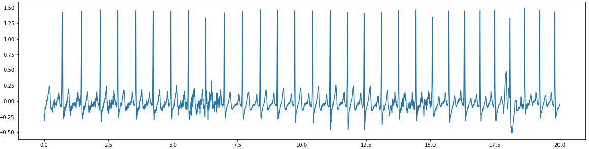
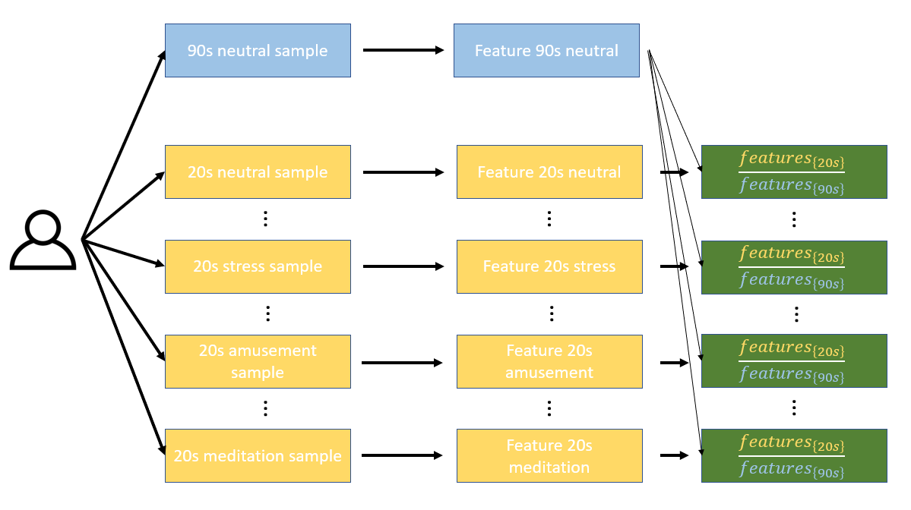
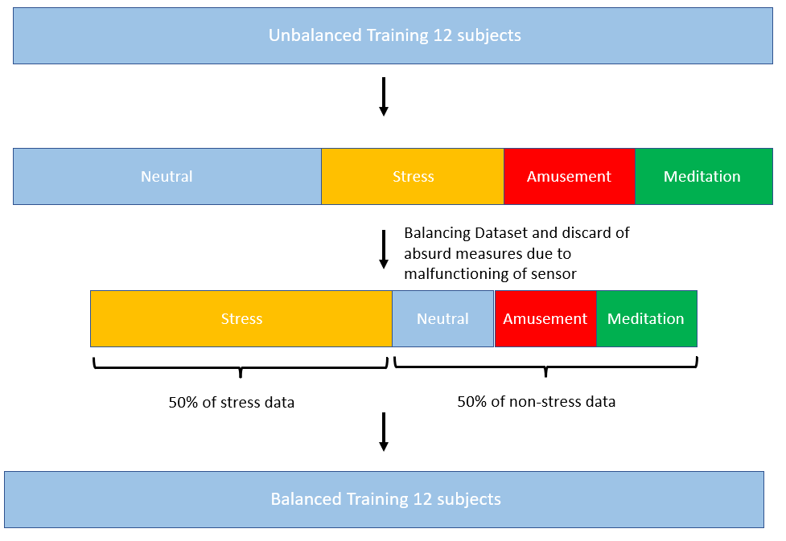
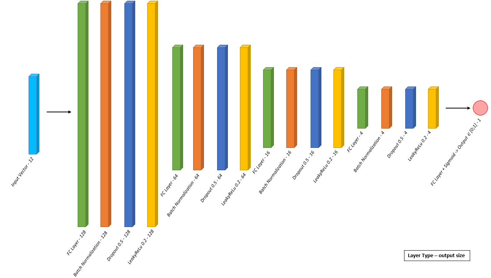
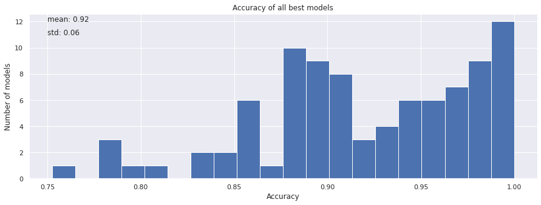
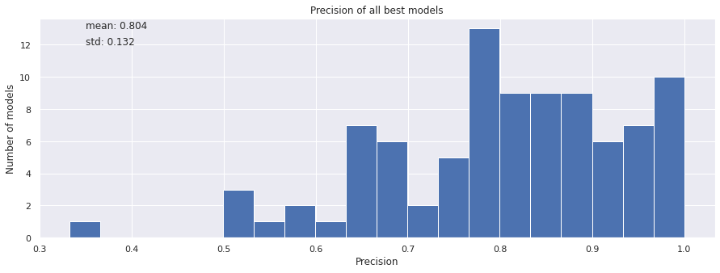
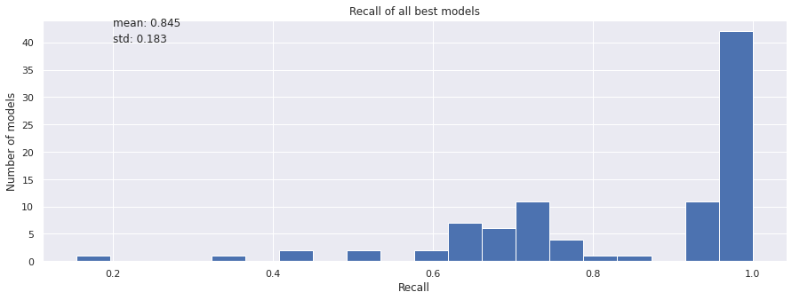
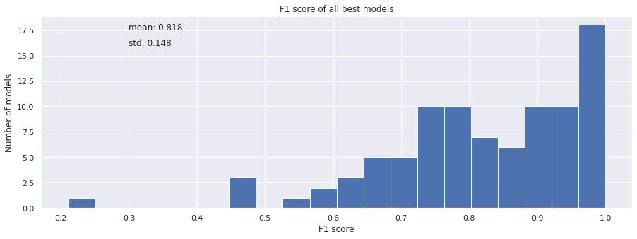

## Table Of Contents
* [Introduction](#introduction)
* [Dataset](#dataset)
* [Data Pre-Processing](#data-pre-processing)
* [Model and Training](#model-and-training)
* [Cross Validation Results](#cross-validation-results)
* [Results on testing set](#results-on-testing-set)
* [References](#references)

## Introduction

This project aims at developing a deep learning model able to predict the emotional state (stress/no stress) of an individual based on his/her ElectroCardiogram signal. The model has been trained on the <a href="https://archive.ics.uci.edu/ml/datasets/WESAD+%28Wearable+Stress+and+Affect+Detection%29">WESAD dataset</a>.

## Dataset

The WESAD is a dataset built by Schmidt P et al [[1]](#1) because there was no dataset for stress detection with physiological at this time.

Among the measures, the dataset contains Electrocardiogram measures of 15 subjects during 2 hours with stressing, amusing, relaxing, and neutral situations. The ECG is measured with an ECG sensor placed on the chest with a frequency of 700Hz. This is a 20s sample from the dataset:

  

## Data Pre-Processing

The Preprocessing of the data is done from the WESAD dataset raw data using the notebooks <a href="./Dataset creator.ipynb">Dataset Creator.ipynb</a> (for Training dataset) and <a href="./Testing ds creator.ipynb">Testing ds creator.ipynb</a>(for testing dataset)

I used <a href="https://github.com/paulvangentcom/heartrate_analysis_python">HeartPy</a> to detect the ECG peaks in the signals. From the ECG signal, I was able to extract features from 20s extracts that appeared to be relevant in the WESAD paper [[1]](#1).
 

| Features      |Units           |
|:-------------:|:-------------:|
|Mean Heart Rate | Beat/s|
|STD Heart Rate | Beat/s|
|TINN | s|
|HRVindex | None|
|\#NN50 | None|
|pNN50 | None|
|Mean HRV | s|
|STD HRV | s|
|RMS HRV | s|
|Mean Fourier Frequencies | Hz|
|STD Fourier Frequencies | Hz|
|Sum PSD components | None|

The exact computation of these features is detailed in the WESAD paper [[1]](#1) and the <a href="./DataPreProcessing Detail.pdf">joined pdf</a>. The computation is also detailed in the comments of the code.

The training has been done with a cross-validation process. I extracted features from samples of 20s with a 1s step from every recording, these samples were coupled with a label: 1=neutral ; 2=stress ; 3=amusement ; 4=meditation. As ECG is very person dependent, I selected a 90s of the baseline (neutral state), extracted the features, and for every 20s sample I divided the features of the sample by the features of the baseline to have a comparison of the sample with a neutral moment from the baseline.

  

I split the data of the 15 subjects into training, validation, and testing to avoid overfitting (as my features are extracted from 20s samples with a sliding window picking training and validation/testing data on the same subject would cause overfitting).
Subjects for training and validation have been permuted as I planned to use K-fold cross-validation (2 subjects in validation, 12 in training), so 91 possible datasets. I selected subject 17 to be my testing subject and I never included this subject in the creation of a fold dataset.

  

Finally, for each created Training dataset, I have chosen to discard incorrect data (for example: 2s between 2 peaks is not biologically possible) due to malfunctioning of the sensors creating troubles in the peak detection. I also have chosen to balance the dataset with 50\% of stress data and 50\% of non-stress data, to improve learning.

  

## Model and Training

The training and results analysis (for cross-validation) of the model can be done using the notebooks <a href="./Model.ipynb">Model.ipynb</a>.

My model is a Full Connected Neural Network. Each Full Connected (FC) layer is followed by a Batch Normalization layer, a Dropout(p= 0.5) layer, and a LeakyRelu (a=0.2) layer.   The size of these layers decreases from 128 &#8594; 64 &#8594; 16 &#8594; 4 &#8594; 1. The final FC layer is followed by a Sigmoid function to obtain an output &#8712; [0;1]. 

The input size is 12 and the output size is 1. An output > *a-given-threshold* is considered as a stress state.

  

For each fold (of the 91-fold), the model has been trained with :

&#8594; **Loss Function** = Binary Cross Entropy  
&#8594; **Epochs** = 15  
&#8594; **Batchsize** = 32  
&#8594; **Learning rate** = 0.0001  
&#8594; **Optimizer** = Adam(learning rate,beta1=0.9,beta2=0.999)  

For each fold training, the best model has been saved (based on the validation set loss value) to compute the results of the cross-validation.

## Cross Validation Results

The **threshold value** (used to predict the emotional state from the output) is set to 0.5.

Confusion Matrix used :

* A 2x2 confusion matrix with Stress/No stress as the ground truth and Stress/No stress as the prediction. This confusion matrix is computed from the validation set and the values in the confusion matrix represent a percentage of the data of the validation set.
* A 2x4 confusion matrix with Emotional state (Neutral,Stress,Amusement,Relax) as the ground truth and Stress/No stress as the prediction. This confusion matrix is computed from the validation set and the values in the confusion matrix represent a percentage of the data of the validation set.

For the best model of each fold the two confusion matrixes are computed on the validation set and the average model confusion matrixes are computed.

  

From the best model of each fold these metrics have been computed on the validation set :

  

  

  

  

The average metrics of my model are :

| Metrics      | Mean &#177; Std|
|:-------------:|:-------------:|
|Accuracy | 0.920 &#177; 0.06|
|Precision| 0.804 &#177; 0.132|
|Recall| 0.845 &#177; 0.183|
|F1 score| 0.818 &#177; 0.148|

The WESAD paper's [[1]](#1) best result on only ECG signals from chest (using Linear Discriminant Analysis) gives:

| Metrics      | Mean Value|
|:-------------:|:-------------:|
|Accuracy | 0.8544|
|F1 score| 0.8131|

My Deep Learning model has an accuracy increased by **6.56%** and a f1 score increased by **0.49%**.

## Testing Results

The model has been retrained with the same process on the complete cross-validation dataset (training + validation) to be tested on new data (subject 17 data). This has been done in the notebooks <a href="./Model_test.ipynb">Model_test.ipynb</a>. 
The best model gives the following confusion matrixes for the testing set (Subject S17):

  

* **Accuracy** = 0.957
* **Precision** = 0.851
* **Recall** = 1.00
* **F1 score** = 0.920

## References
<a id="1">[1]</a> Philip Schmidt et al. “Introducing WeSAD, a multimodal dataset for wearable stress and affect detection”. In: ICMI 2018 - Proceedings of the 2018 International Conference on Multimodal Interaction (Oct. 2018), pp. 400–408. doi: <a href="https://doi.org/10.1145/3242969.3242985">10.1145/3242969.3242985</a>.
